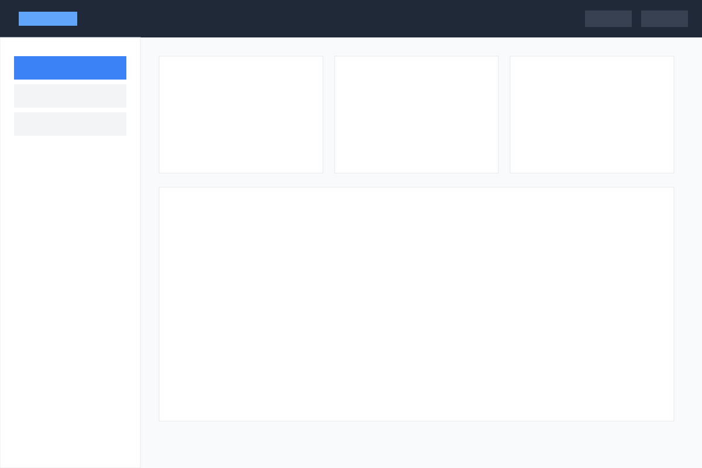

# Example: Dashboard

A typical SaaS dashboard with top navigation, left sidebar, three KPI cards
in a grid, and a main content area below.

## Input



The input is a synthetic 1200×800 dashboard layout (see `input.svg` for the source).

## Output

See [`output.json`](./output.json) for the full structured tree.

### What the pipeline extracted

- **10 regions** detected — covers the navigation, sidebar items, KPI cards,
  and main content area
- **`card_grid` pattern** detected for the 3 uniformly-sized cards in a row
- **`list` pattern** detected for the 3 sidebar menu items

### What the LLM would see

```json
{
  "detected_patterns": ["card_grid", "list"],
  "region_count": 10,
  "root": {
    "children": [
      // nav elements, sidebar items, 3 cards, main panel
    ]
  }
}
```

This pattern information is the most actionable signal for code generation.
Knowing that there's a `card_grid` of 3 uniform items lets the LLM emit:

```jsx
<div className="grid grid-cols-3 gap-4">
  {cards.map((card) => <Card {...card} />)}
</div>
```

instead of three repeated copies of the same block.

## Reproduce

```bash
npm run build
node gen-examples.mjs
```
